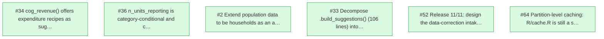

# Project status

> Between the compass markers is generated. Edit the sources, not this.

<!-- compass:begin -->
<!-- compass:board -->

## Where this stands

uscogdata is at 0.4.0 and its public surface is settled: the query verbs, the cohort
predicates added in this release, and the provenance contract every verb returns.

The six open issues split cleanly. Two are API work carried out of the #9 review pass
and deliberately deferred there rather than fixed in that branch. Three concern the
corpus layer, and the largest of them, partition-level caching, was named the single
highest-leverage change on the remote path before being deferred. One, the
data-correction intake, is a decision rather than a task: it was parked during the
0.3.0 design and it gates the API announcement, because without it the corpus cannot
make the "traceable and correctable" claim that most distinguishes it from Census's
own files.

Nothing here is blocked on anything else, so the ordering is a judgement about value
rather than a dependency graph.

## Ready to work on next

- **#34** cog_revenue() offers expenditure recipes as suggestions: scope the candidate query by category_type · `ws/api` — nothing is blocking it; something is currently wrong
- **#36** n_units_reporting is category-conditional and cannot be read as a response rate · `ws/corpus` — nothing is blocking it; owed work from an earlier change
- **#2** Extend population data to be households as an alternate spending denominator · `ws/corpus` — nothing is blocking it
- **#33** Decompose .build_suggestions() (106 lines) into named helpers · `ws/api` — nothing is blocking it
- **#52** Release 11/11: design the data-correction intake (deferred; gates the API announcement) · `ws/corpus` — nothing is blocking it
- **#64** Partition-level caching: R/cache.R is still a stub, and the remote path pays for it every session · `ws/corpus` — nothing is blocking it

## Workstreams

| Stream | Commits since | Open | Debt | Owes docs |
|---|---|---|---|---|
| Query verbs and results | 77 | 2 | 0 | no |
| Corpus, mirror, provenance | 39 | 4 | 1 | no |
| Vignettes and guides | 34 | 0 | 0 | **yes** |

## CI

Dependency graph and detail

- Marker: `none` (no journal entry yet)
- Commits since: 164
- Open issues: 6

<!-- compass:end -->
